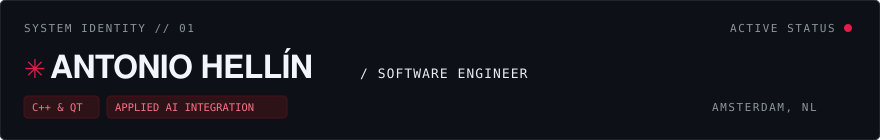

<div align="center">



<br/>

[](https://resume-shine-toggle.lovable.app)
[](https://resume-shine-toggle.lovable.app)
[](https://resume-shine-toggle.lovable.app)
[](https://linkedin.com/in/antoniohellinh)

</div>

<br/>


Software Engineer combining foundational expertise in **low-latency C++**, **native Qt application architecture**, and **hardware-interfacing SDKs** with high-throughput **AI-augmented engineering**. Track record spans real-time optical tracking instrumentation, industrial robotic automation cells, and distributed local-first architectures.

---

### <font color="#e11d48">✱</font> Core Work & Architectures

<table>
  <tr>
    <td width="50%" valign="top">
      <h4><font color="#e11d48">✱</font> PST SDK</h4>
      <p><b>Cross-platform Optical Tracking Core</b> · <i>PS-Tech</i></p>
      <p>Architected modular C++ core library delivering low-latency real-time pose estimation. Integrated high-performance native wrappers across 4 environments.</p>
      <code>C++</code> <code>C</code> <code>Python</code> <code>C#</code> <code>CMake</code>
    </td>
    <td width="50%" valign="top">
      <h4><font color="#e11d48">✱</font> Automated robotic calibration</h4>
      <p><b>Hardware Orchestration & Protocols</b> · <i>PS-Tech / OMRON</i></p>
      <p>Designed backend communications and data pipelines interfacing OMRON 6-axis robotic arms with custom desktop Qt control surfaces.</p>
      <code>C++</code> <code>Qt/QML</code> <code>Industrial Robotics</code> <code>Protocols</code>
    </td>
  </tr>
  <tr>
    <td width="50%" valign="top">
      <h4><font color="#e11d48">✱</font> Vesalius3D</h4>
      <p><b>Surgical 3D Volumetric Engine</b> · <i>PS-Tech</i></p>
      <p>High-fidelity interactive 3D rendering pipeline for CT, MRI, and ultrasound volumes dynamically positioned via real-time optical targets.</p>
      <code>C++</code> <code>3D Graphics</code> <code>Medical Imaging</code> <code>Optics</code>
    </td>
    <td width="50%" valign="top">
      <h4><font color="#e11d48">✱</font> Formide</h4>
      <p><b>Embedded Linux & Firmware Interface</b> · <i>Printr</i></p>
      <p>Engineered hardware communication layer for Repetier and Marlin 3D printers with embedded touch UI running on native Qt/Linux.</p>
      <code>C++</code> <code>Qt</code> <code>Embedded Linux</code> <code>Firmware</code>
    </td>
  </tr>
  <tr>
    <td width="50%" valign="top">
      <h4><font color="#e11d48">✱</font> Local-First Desktop Invoicing</h4>
      <p><b>Distributed Architecture</b> · <i>Independent Project</i></p>
      <p>Architected a privacy-focused, local-first desktop application generating real-time invoices, leveraging a decoupled backend/frontend structure.</p>
      <code>Go</code> <code>React</code> <code>Desktop Architecture</code> <code>Local-First</code>
    </td>
    <td width="50%" valign="top">
      <h4><font color="#e11d48">✱</font> AR Indoor Positioning</h4>
      <p><b>Device Triangulation</b> · <i>Academic / UPCT</i></p>
      <p>Designed a GPS-independent Android augmented reality application utilizing camera vision and triangulation for indoor location tracking.</p>
      <code>Android</code> <code>Computer Vision</code> <code>Augmented Reality</code>
    </td>
  </tr>
</table>

---

### <font color="#e11d48">✱</font> Technical Matrix

```text
SYSTEMS & NATIVE  ::  Modern C++ (17/20), C, Qt 5/6, QML, Embedded Linux, POSIX
TRACKING & VISION ::  Optical Tracking SDKs, Triangulation, Pose Estimation, 3D Mesh
INTELLIGENCE & AI ::  LLMOps, RAG Architectures, Vector Stores, Local Inference
WEB & BACKEND     ::  Go, React, TypeScript, Next.js
PLATFORM & BUILD  ::  CMake, Git, GitLab CI/CD, Docker, TDD, Protocol Buffers
